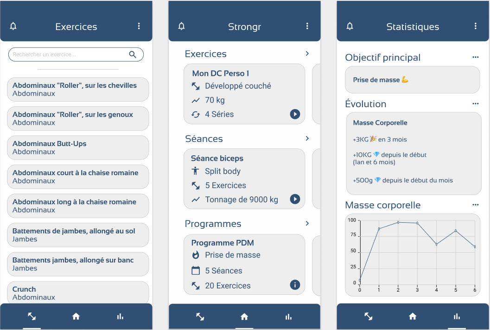



# Strongr

Strongr est une application mobile cross-plateformes (Flutter) sur le thème de l'entrainement sportif. Elle permet entres-autres la création d'exercices, de séances et de programmes personnalisés, ainsi que le suivi en temps réel du déroulé de ces derniers.

### Les exercices

Une liste d’exercices prédéfinis sont proposés sur l’application. Ils peuvent être visualisés en détail sur une vue dédiée. Chaque exercice peut être personnalisé et ajouté à des séances de sport en spécifiant des informations complémentaires à propos de sa réalisation, c’est-à-dire le matériel à utiliser, la méthode de travail associée et le nombre de séries à effectuer.

### Les séances

La liste des séances regroupe toutes les séances créées. Une séance est un ensemble d’exercices auquel sont renseignées des informations supplémentaires comme l’ordre dans lequel pratiquer les exercices de la séance, le nombre de séries à pratiquer pour chaque exercice et le nombre de répétitions à effectuer pour chacune de ces séries. Les séances pourront ensuite être regroupées entre elles afin de créer des programmes personnalisés.

### Les programmes 

La liste des programmes représente l’ensemble des programmes créés. Un programme est un ensemble de séances. Dans le cadre de l’application, un programme comprend sept emplacements de séances, ce qui permet d’aligner les programmes avec les semaines, où chaque emplacement représente un jour de la semaine. Tous les emplacements du programme ne doivent pas forcément être comblés par une séance, mais ce dernier doit avoir au moins deux emplacements de séances occupés au minimum pour être considéré comme un programme. La répartition des séances sur les emplacements du programme est libre.

### Wireframes de l'application (réalisées avec Figma) :

